# 202 Project: IMU-based LLMs HAR Performance on Edge Device
[Github repo](https://github.com/yichenyang18/202_IMU_HAR_LLAMA)
## Table of Contents
1. [Abstract](#abstract)
2. [Introduction](#introduction)
    1. [Motivation and Objective](#motivation-and-objective)
    2. [Prior Work](#prior-work)
    3. [Novelty of This Work](#novelty-of-this-work)
3. [Technical Approach](#technical-approach)
4. [Evaluation and Results](#evaluation-and-results)
5. [Discussions and Conclusions](#discussions-and-conclusions)
6. [References](#references)


## Abstract
In this project, we will explore and try to augment LLMs' reasoning and cognition in relation to the physical world on edge devices (smartphones), 
evaluated by the performance on Human Activity Recognition (HAR) classification task based on the 
data from inertail measurement units (IMU). We will implement techniques including paramter fine-tuning, 
model prompt configuration, data enrichment, etc and meausure the accuracy, latency, and memory usage.


## Introduction

### Motivation and Objective
In recent years, Large Language Models (LLMs) have demonstrated impressive capabilities
in understanding and generating human language. However, their potential for reasoning
and cognition in relation to the physical world, particularly when dealing with sensor
data from Internet of Things (IoT) devices, remains an area of exploration. IoT devices, 
especially in applications like Human Activity Recognition (HAR), generate complex sensor 
data that LLMs could potentially process for higher-level reasoning and pattern recognition. 
Our project seeks to explore how LLMs can leverage this sensor data to improve understanding 
and classification of physical activities, while addressing key challenges such as 
computational resource limitations, memory usage, and latency on edge devices like smartphones.

Our goal is to assess the performance of LLMs for IMU-based HAR classification tasks on 
smartphones, optimizing them for resource-constrained environments. We will explore techniques 
such as parameter fine-tuning, prompt configuration, data augmentation, etc. to balance 
accuracy, latency, and memory usage. By analyzing trade-offs between model complexity and 
real-world performance, we aim to identify strategies that enhance classification accuracy 
while ensuring efficient deployment on smartphones.

### Prior Work
In research paper "IoT LLM: Enhancing Real World IoT Task Reasoning With Large Language Models" that is published in 2024, 
the authors explore how LLMs can augment reasoning in analyzing IoT device data and performing 
tasks such as industrial anomaly detection, indoor localization, and human activity recognition. 
However, only accuracy is considered in this paper, and other factors such as latency is not 
studied.

### Novelty of This Work
Since the majority of sensor data is collected by edge devices, including smartphone, 
smart home devices, industrial IoT devices, it is convenient and intuitive to use LLMs 
that are deployed on these devices to analyze data and perform related tasks. In addition, 
since LLMs are generally very large, performance-related factors, such as latency and 
computational resource consumption, is also what we consider. Thus, inspired by prior 
works, we want to explore how we can explore and augment LLMs' reasoning from and towards 
real world while addressing the challenges associated with deploying them on edge devices.


## Technical Approach

### Model fine-tuning
#### Baseline 
For accuracy performance, we set the baseline using the Llama 3.2 1B model with a training dataset size of 1800 samples. For both accelerometer and gyrometer data in the x, y, and z directions, we provided only the first value. For the text input, we specified only what the number represents.

Dataset (1800 samples):


Text Input:

“body_acc_x: 1.808515, body_acc_y: 1.076681, body_acc_z: 5.556068; body_gyro_x: 6.601362, body_gyro_y: 6.601362, body_gyro_z: 2.285864; total_acc_x: 1.012817, total_acc_y: -1.232167, total_acc_z: 1.029341”

Number of Epoch: 3

Validation Accuracy: 35.28%


#### Base Model Change
Following tests with the Llama 3.2 1B model, we experimented with the 3B model, which has more parameters. We anticipated that the more complex model would yield better performance in Human Activity Recognition (HAR). Using the same inputs and dataset, we fine-tuned the 3B model on Google Colab Pro with an A100 GPU.

Dataset (1800 samples):


Text Input:

“body_acc_x: 1.808515, body_acc_y: 1.076681, body_acc_z: 5.556068; body_gyro_x: 6.601362, body_gyro_y: 6.601362, body_gyro_z: 2.285864; total_acc_x: 1.012817, total_acc_y: -1.232167, total_acc_z: 1.029341”

Number of Epoch: 3

Validation Accuracy: >35.28%

Due to the 3B model size, I had to run the fine tune task on Google Colab pro with A1000 GPU. However, it disconnected after 7h. It finished the first 2 epoch. For the record, we got much lower training losses that are around 1.9 and 1.4. We estimated that the validation accuracy will be higher and better.

#### Dataset Change
Continuing with the Llama 3.2 1B model, we reduced the dataset size to 600 samples. Instead of providing a single value for x, y, and z accelerometer and gyrometer data, we provided a list containing three values. All other parameters remained unchanged.

Dataset (600 samples):

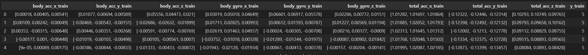

Text Input:

“The data is measured and collected in 2.56s. body_acc_x: [list], body_acc_y: [list], body_acc_z: [list];
body_gyro_x: [list], body_gyro_y: [list], body_gyro_z: [list]; total_acc_x: [list], total_acc_y: [list], total_acc_z: [list]
Based on these numbers, classify what the person is doing during 2.56s?”

Number of Epoch: 3

Validation Accuracy: 20.83%

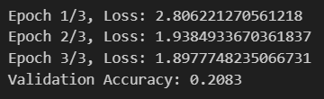

#### Casual Model Change
After resolving an issue with convert_hf_to_gguf.py, we defined a custom LlamaForSequenceClassification class and fine-tuned the model using a causal language model (LLM) as the base.

Same Dataset and text input

Changing LlamaForSequenceClassification to Causal LLM

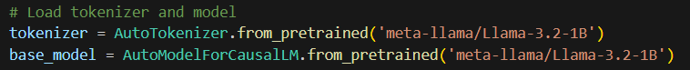

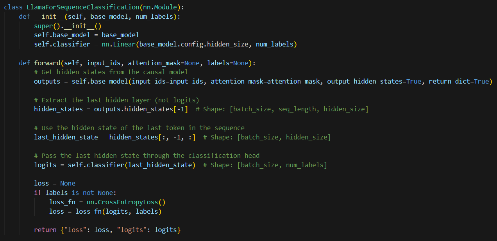

LlamaForSequenceClassification is fine-tuned specifically for sequence classification tasks, where the model learns to map an entire input sequence to a single class label. Causal LLMs is trained for causal language modeling, where the model predicts the next token in a sequence based on preceding tokens. The causal LLM performs worse because it is not inherently designed for classification tasks. For classification tasks, using a specialized model is preferable.

Number of Epoch: 3

Validation Accuracy: 17.50%

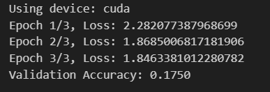

#### Number of Epoch Change
The same model we used in last page.

Same text input format.

Same dataset.

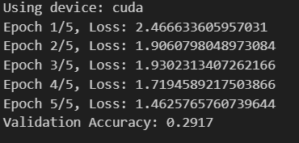

We increase the number of epoch to 5.

We can see the accuracy improves a lot.

Number of Epoch: 5

Validation Accuracy: 29.17%

However, keep increasing the number of epoch does not always increase the validation accuracy. During training, the model learns patterns from the training data. With too many epochs, it begins to "memorize" the training data, including noise and specific details that don't generalize well to unseen data.
The training accuracy may continue to improve, but the validation accuracy will stagnate or even decrease as the model becomes overfit and loses its ability to generalize. When I increase the number of epoch to 10, the training loss goes to 0, which shows that the model is overfitting.

#### Data Presentation
Dataset (600 samples):

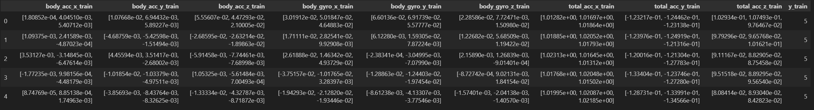

Same text Input, but we use scientific notation instead of float. 

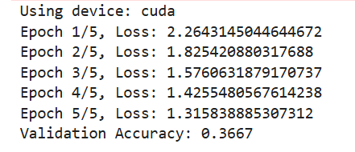

Number of Epoch: 5

Validation Accuracy: 36.67%

This result suggests that scientific notation may enhance LLM fine-tuning for tasks involving large or small numerical values, precision-critical requirements, or token efficiency constraints.

#### Domain Knowledge
Additionally, we incorporated domain knowledge into the LLM following fine-tuning techniques from a referenced paper. However, this approach did not yield the expected results.

Message we added:

Using accelerometer and gyroscope data recorded along the x, y, and z axes, classify the activity being performed as one of the following: Walking, Walking Upstairs, Walking Downstairs, Sitting, Standing, or Laying. 

Each activity exhibits distinct motion patterns:

Walking: Moderate, periodic accelerations and angular velocities in all directions.

Walking Upstairs: Increased vertical motion (z-axis) compared to walking.

Walking Downstairs: Irregular, high vertical impacts (z-axis).

Sitting: Minimal acceleration and angular velocity, near-static.

Standing: Similar to sitting, but with potential minor shifts.

Laying: Negligible motion, consistent low values across all axes.

The data has been segmented into 2.56-second windows, with each window characterized by extracted features

like mean, variance, and frequency-domain properties. Use these patterns to identify the activity.

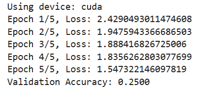

Number of Epoch: 5

Validation Accuracy: 25.00%

Why the performance become worse?

1. Increased Input Complexity

    Adding domain knowledge increases the input's length and complexity. The model may struggle to identify which parts of the input are critical for classification, leading to worse performance.

2. Misalignment of Domain Knowledge with Model Understanding

    If the provided domain knowledge is not formatted or structured in a way that aligns with the LLM's training data or architecture, the model might misinterpret it.

3. Distracting or Conflicting Information

    Domain knowledge can introduce information that: Conflicts with the patterns learned by the model. Distracts from the core features needed for classification.

4. Overloading the Model's Context Window

    LLMs have a fixed context window size. If the domain knowledge plus input data exceeds this limit, older or truncated parts of the input might be ignored.

#### Convert_hf_to_gguf.py Issue
This script is designed to convert Hugging Face (HF) models to GGUF format, typically targeting causal language models (CLMs) like LlamaForCausalLM. However, classification models like LlamaForSequenceClassification have architectural and functional differences that the script might not account for.

To solve this problem, we already changed the model to AutomodelforcausalLM. We managed to convert the new fine-tuned model into GGUF outtype.  

#### Conclusion
1. The number of epochs affects how well the model learns from the training data; too few epochs can lead to underfitting, while too many may result in overfitting, harming generalization to unseen data. 

2. The dataset size is equally important—larger datasets provide more diverse examples for the model to learn patterns.

3. The data presentation plays a significant role; clear, consistent formatting and well-structured inputs allow the model to better extract relevant features, while noisy or unstructured data can confuse the learning process. 

4. The domain knowledge can enhance performance if it is relevant and well-integrated, but excessive or poorly contextualized domain information can overwhelm the model, leading to reduced accuracy. 

5. The choice of base model establishes the starting point for fine-tuning; pretrained models with architectures and training objectives aligned to the task are more likely to yield higher accuracy compared to mismatched or less capable models.


### Performance test on smartphone
The objective of this part is to explore techniques for augmenting LLM's capability to perform HAR tasks on edge device 
(Android) and analyze the influence of these techniques with multiple factors
(total duration, prompt evaluation rate, response evaluation rate, memory usage, etc.). In consideration of 
the processing latency, we choose to evaluate LLMs' performance on HAR binary classification.

#### Hardware description
In this project, we select One plus 9 pro, an Android device published in 2021.
- CPU: Qualcomm Snapdragon 888 (8 cores)
- GPU: Adreno 660
- RAM: 12GB
- Storage: 256GB

#### Model deployment
In order to deploy our model on Android smartphone, we use Termux platform, which is a power 
terminal emulator and Linux environment app for Android and provides a wide range of tools typically 
available on full-fledged Linux system. It can be downloaded from https://github.com/termux/termux-app/releases.

Once Termux is successfully set up, we use it to deploy Ollama first, which is platform designed to 
make it easier for developers to run LLMs locally. It can be downloaded from https://github.com/ollama/ollama.

After Ollama is set up, we could use `ssh`/`scp` then to send local models from computer to the 
phone and remotely manipulate Termux. For the details in model deployments, please look at [this tutorial](./tutorial.md).

For testing, we have written a Shell script that can automatically feed input files to the LLM.

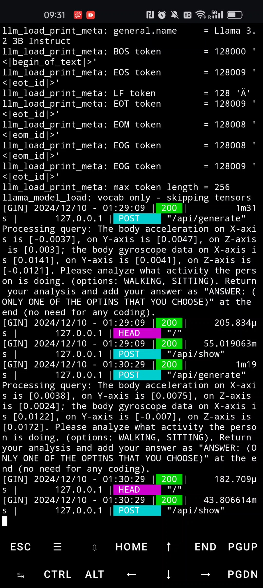

(Model testing on Android system)

#### Baseline performance
For the baseline test of our model, we generate different test input files based on the raw 
data, with different data points (1 - 6 data points). The raw data is collected at a frequency of 50 Hz, meaning that 
it has 50 data points per second. In consideration of both processing lantency and key features contained 
in the data, we downsampled the data to 2.5Hz, meaning that that time interval between any two data points 
is 0.4s.

Below is a sample input:
```
The body acceleration on X-axis is [-0.0889], on Y-axis is [0.3492], on Z-axis is [0.292];
the body gyroscope data on X-axis is [0.0585], on Y-axis is [0.0347], on Z-axis is [-0.1154]. 
Please analyze what activity the person is doing. (options: WALKING, SITTING). Return your analysis 
and add your answer as "ANSWER: (ONLY ONE OF THE OPTIONS THAT YOU CHOOSE)" at the end (no need for any coding).

```

#### Model prompt configuration with domain knowledge
Based on the baseline, we aim to augment the model using prompt configuration. As LLMs possess strong role-playing capabilities, 
custimizing LLMs with prompt configuration may invoke the interval knowledge of them, leading to an 
increase of accuracy. In the `.makefile` file that we use to customize LLM, we have defined the specific role that we 
want the LLM to act like, included IMU-related domain knowledge, and finally asked the model to perform classification by 2 step: 
first freely analyze the given input data, and then make the conclusion based on the analysis. Below is the template for 
prompt configuration.

```
SYSTEM """
{Role definition}


{Expert}


{Examples}


{Question definition}


{Response Format}
"""
```

#### Data augmentation 1
Since LLMs are not specifically designed to handle numerical data study, it is not surprising that raw data cannot achieve a satisfying result.
Because IMU data alone can be insufficient for perform tasks like HAR through IMU data, we thus tried to provide a comprehensive text analysis towards the distribution of the data 
also the meaning for the units, along with our raw data. Below is the template we use as the input prompt.

```
Template used for input prompt generation:

Triaxial acceleration data: {data with unit}
X-axis mean:              X-axis variance:
Y-axis mean:              Y-axis variance:
Z-axis mean:              Z-axis variance:


Triaxial gyroscope data: {data with unit}
X-axis mean:              X-axis variance:
Y-axis mean:              Y-axis variance:
Z-axis mean:              Z-axis variance:

(Extra knowledge) The data is collected from an IMU with a frequency of {...}Hz. The unit for acceleration is {...}, 
meaning {...}. The unit for gyroscope is {...}, meaning {...}. 

```

#### Data augmentation 2
Another way for data augmentation is to provide frequency-domain features. Time series data can be confusing for 
LLMs to extract important features. On the other hand, frequency analysis methods are used 
to reveal patterns in signals that are not easily visible in the time domain. They help 
in identifying the underlying frequency structure, filtering noise, and extracting features 
for tasks like classification. Below is the signal processing workflow:
- Median filter
- 3rd Butterworth low-pass filter with a cutoff frequency of 20Hz
- Fast Fourier Transform (FFT)
- Extract key features: e.g. total spectrum energy

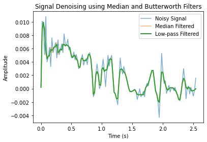
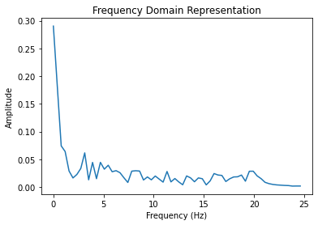

## Evaluation and Results

### Model fine-tuning
See the above explanation in [Technical Approach](#technical-approach). 

### Performance test on smartphone
#### Baseline
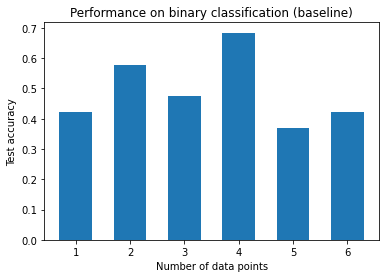
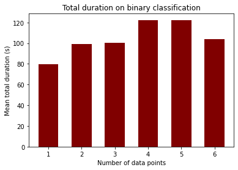
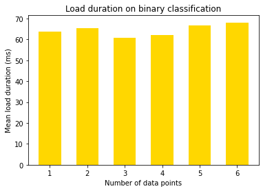
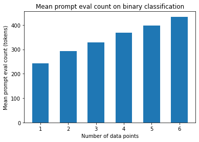
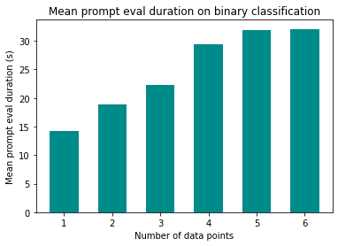
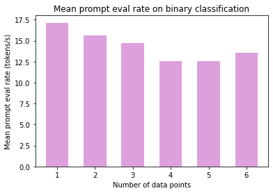
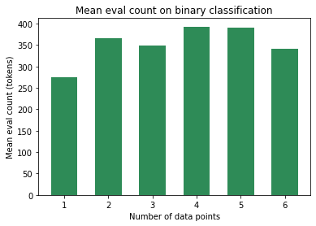
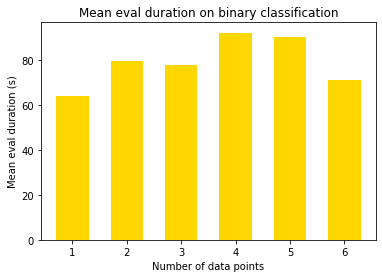
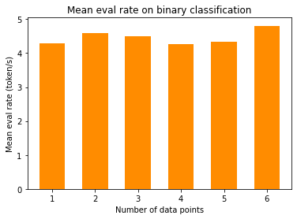

The total test is performed on a relatively small dataset, around 120 input prompts in total. 
The accuracy varies from aroud 0.4 - 0.7, indicating a not good result as we have expected to see. 
In terms of lantency, we can see that even though prompt evaluation duration is doubled
as the number of data points increases from 1 to 6, but the total duration/lantency is not largely 
effected, as the (response) evaluation duration takes a larger proportion in total duration in this 
case.

#### Model prompt configuration with domain knowledge
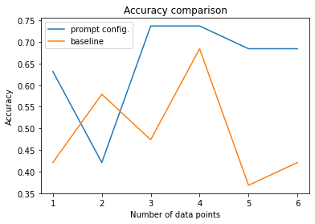
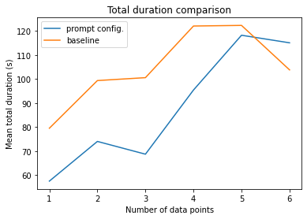
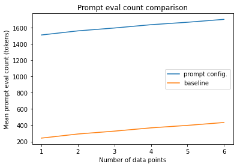
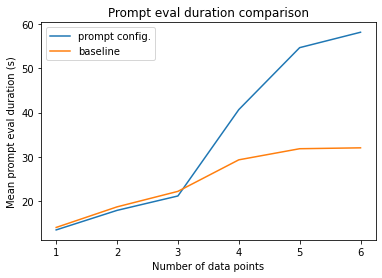
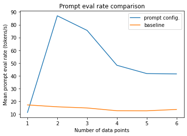
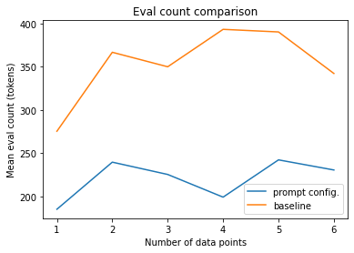
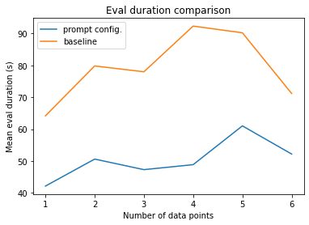
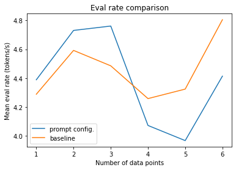

After custimizing the model with prompt and domain knowledge, we can see a general increase in accuracy, 
meaning that by providing LLM with domain-specific knowledge and question analysis logic, we can improve its 
reasoning towards analyzing real-world situation.

In terms of latency, we discover a surge in prompt evaluation count and duration even though we have kept the input data 
unchanged, indicating that the custimization file makes the LLM process more tokens when dealing with the same inputs. 
However, it appears that the total duration is not influenced, even has a potential to decrease, due to the smaller response 
evaluation count and duration. We believe that this is because the prompt configuration makes it easier for the model to 
capture the key features in the inputs, leading to less analysis outputs but a better accuracy compared to the baseline.

#### Data augmentation 1
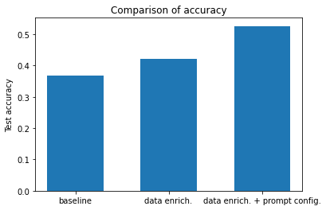
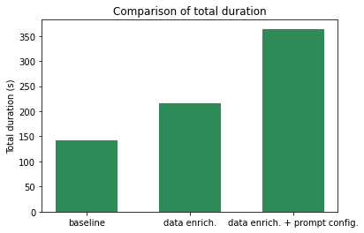
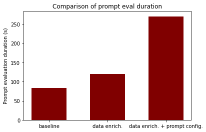

Although we have only tested date enriched inputs in a small scale of tests, 
the results already appear to be undesirable. While the accuracy does not show an 
increase compared to previous results, the total duration (mainly prompt evaluation duration) 
surges. 

We believe that the reason behind this phenomenon is that ss the input complexity increases, the model may struggle to determine which parts of the 
input are critical for the task, resulting in little or no improvement in accuracy.

#### Data augmentation 2
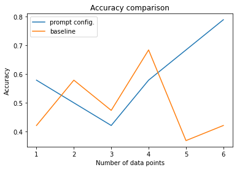
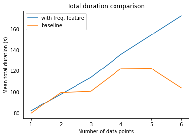

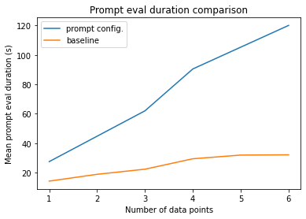
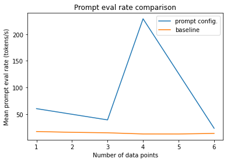
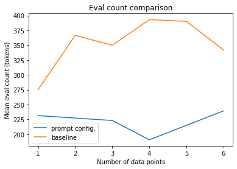
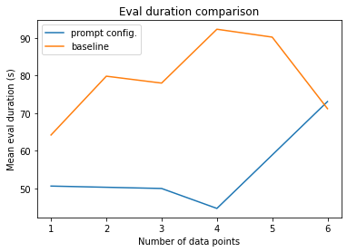
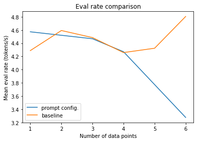

Denoising input data and providing the LLM with frequency domain features generally results similarly as what we did in prompt configuration. However, the total 
duration/latency is greatly increased. We can possibly conclude that increasing information entropy in the input prompts may not be efficient as custimization, 
as the processing duration generally increments more. 


#### Memory usage
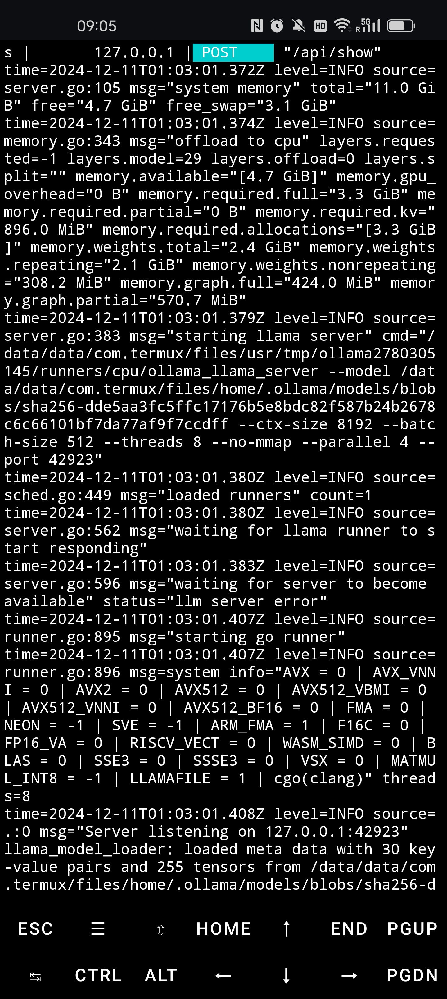

System Memory Status:
- Total system memory: 11.0 GiB
- Free system memory: 4.7 GiB
- Free swap memory: 3.1 GiB

Model Memory Status:
- Full memory required: 3.3 GiB
- Partial memory required: 0 B 
- Key-value memory required: 896.0 MiB
- Weights total memory: 2.4 GiB
  - Repeating weights: 2.1 GiB
  - Non-repeating weights: 308.2 MiB
- Graph memory requirements:
  - Full graph: 424.0 MiB
  - Partial graph: 570.7 MiB

## Discussions and Conclusions
### Conclusion from fine-tuning LLMs
1. The number of epochs affects how well the model learns from the training data; too few epochs can lead to underfitting, while too many may result in overfitting, harming generalization to unseen data. 

2. The dataset size is equally important—larger datasets provide more diverse examples for the model to learn patterns.

3. The data presentation plays a significant role; clear, consistent formatting and well-structured inputs allow the model to better extract relevant features, while noisy or unstructured data can confuse the learning process. 

4. The domain knowledge can enhance performance if it is relevant and well-integrated, but excessive or poorly contextualized domain information can overwhelm the model, leading to reduced accuracy. 

5. The choice of base model establishes the starting point for fine-tuning; pretrained models with architectures and training objectives aligned to the task are more likely to yield higher accuracy compared to mismatched or less capable models.

### Conclusion from performance test on edge devices
1. Generally speaking, providing LLMs with more background knowledge, including the physical meaning of data, the background of the task, a few samples, or the statistical features of data, will help increase the 
reasoning and logic of the models.

2. However, giving too much information/features will result in a better performance, while the prompt evaluation duration will highly increase, leading a large latency. The better way is to customize the model first and then feed with a proper amount of data.

3. The future direction for this project would be training LoRA adapters for extent LLMs like Llama3.2, which can theoretically increase the performance while maintaining a reasonable latency and memory usage.


## References
1. An, Tuo, et al. IoT-LLM: Enhancing Real-World IoT Task Reasoning with 
Large Language Models. arXiv:2410.02429, arXiv, 4 Oct. 2024. arXiv.org, 
https://doi.org/10.48550/arXiv.2410.02429.
2. Ji, Sijie, et al. HARGPT: Are LLMs Zero-Shot Human Activity Recognizers? 
arXiv:2403.02727, arXiv, 5 Mar. 2024. arXiv.org, https://doi.org/10.48550/arXiv.2403.02727.

